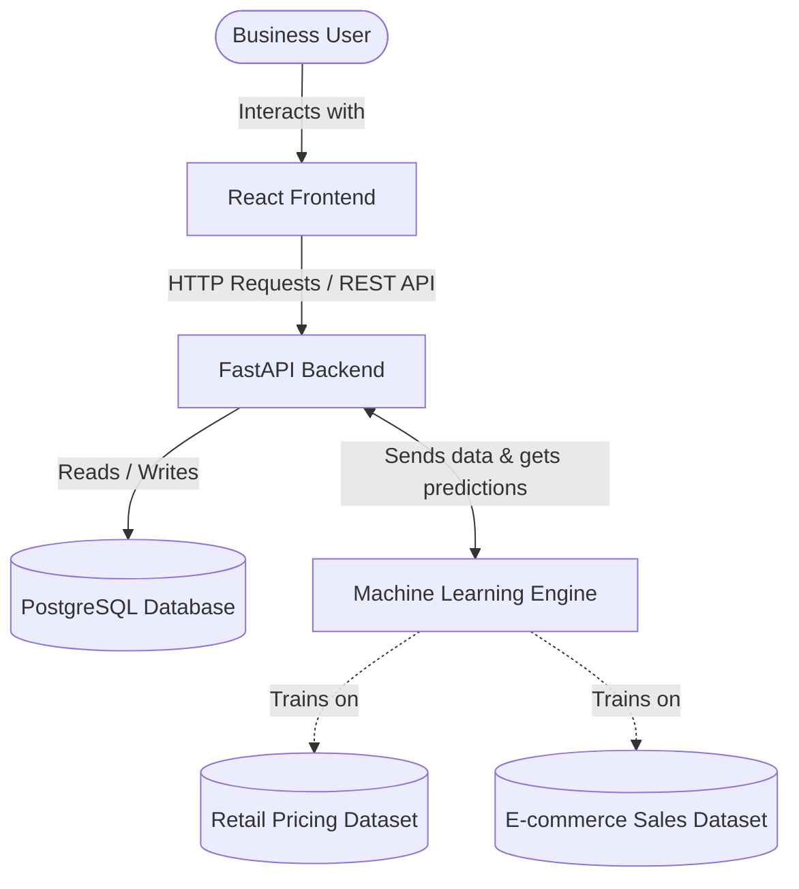
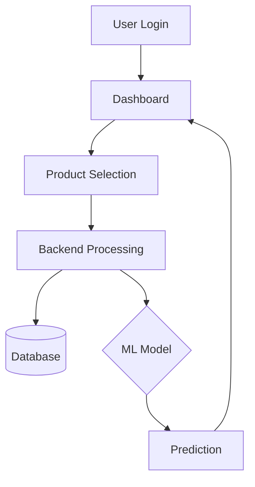
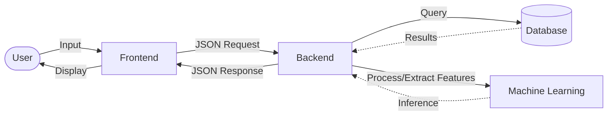
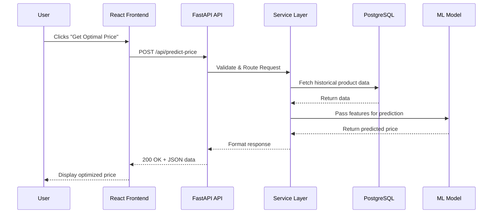
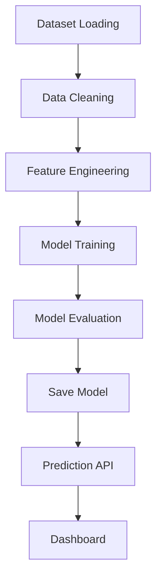

# 1. Architecture Overview

PricePilot AI utilizes a highly modular **3-Tier Clean Architecture** (Presentation, Application/Domain, and Data tiers) tightly integrated with a dedicated **Machine Learning Engine**. 

This architecture is exceptionally suitable for an AI-powered Dynamic Pricing System because it isolates complex, computationally heavy machine learning operations from the core web API. This separation ensures that the frontend remains highly responsive for business users, the backend can safely orchestrate database queries, and the ML engine can independently scale to handle intensive data processing and predictive analytics.

---

# 2. High-Level System Architecture

### Component Responsibilities:
- **Business User**: Interacts with the visual dashboards to view prices, competitor data, and adjust pricing strategies.
- **React Frontend**: Serves as the user interface. It renders interactive charts, handles user inputs, and displays AI predictions without maintaining business state.
- **FastAPI Backend**: The central orchestrator. It handles authentication, data validation, interacts with the database, and serves as a bridge to the ML Engine.
- **PostgreSQL Database**: The persistent storage layer. It securely holds user accounts, product catalogs, historical pricing, and saved predictions.
- **Machine Learning Engine**: The brain of the system. It processes incoming data against trained models (XGBoost, Prophet, LSTM) to output optimized price recommendations.
- **Retail & E-commerce Datasets**: The historical and competitive market data used to train, test, and validate the machine learning models offline.

---

# 3. Layered Architecture

PricePilot AI follows a strict layered architecture pattern to ensure separation of concerns.

### Presentation Layer
- **Purpose**: To provide an intuitive interface for the end-user.
- **Components**: React.js, Tailwind CSS, Recharts.
- **Responsibilities**: Rendering data, managing local UI state, capturing user inputs, and displaying dashboards.
- **Communication**: Communicates exclusively with the Application Layer via RESTful HTTP APIs.

### Application Layer
- **Purpose**: To enforce business rules and orchestrate system actions.
- **Components**: FastAPI routers, Pydantic schemas, Service classes.
- **Responsibilities**: Request routing, data validation, authentication, and coordinating data between the DB and ML layers.
- **Communication**: Receives requests from the Presentation Layer, fetches data from the Data Layer, and triggers inferences in the ML Layer.

### Data Layer
- **Purpose**: To safely persist and retrieve application state.
- **Components**: PostgreSQL, SQLAlchemy ORM, Alembic (Migrations).
- **Responsibilities**: Executing CRUD operations, ensuring data integrity, and handling database schemas.
- **Communication**: Interacts exclusively with the Application Layer. It does not know about the web or UI.

### Machine Learning Layer
- **Purpose**: To generate predictive intelligence.
- **Components**: Scikit-Learn, XGBoost, Prophet, TensorFlow.
- **Responsibilities**: Data preprocessing, feature engineering, model training, and serving real-time predictions.
- **Communication**: Triggered by the Application Layer via internal service calls to provide AI inferences.

---

# 4. Module Architecture

The system is divided into focused business modules.

### User Management
- **Purpose**: Secures the platform and manages access.
- **Responsibilities**: Registration, login, password hashing, and JWT token issuance.
- **Input**: User credentials (email, password).
- **Output**: JWT Auth Token, user profile data.
- **Technologies Used**: FastAPI Security, Passlib (bcrypt), PostgreSQL.

### Product & Pricing Management
- **Purpose**: Maintains the core catalog of items and their current prices.
- **Responsibilities**: Adding, updating, and viewing products and base pricing rules.
- **Input**: Product metadata, base costs, margins.
- **Output**: Formatted product catalogs.
- **Technologies Used**: FastAPI, SQLAlchemy, React tables.

### Price Prediction
- **Purpose**: Calculates the mathematically optimal price for a product.
- **Responsibilities**: Applying ML algorithms to determine maximum revenue/profit points.
- **Input**: Current date, inventory levels, base cost.
- **Output**: Suggested optimal price, confidence score.
- **Technologies Used**: XGBoost, Scikit-Learn.

### Demand Forecasting
- **Purpose**: Predicts future sales volume.
- **Responsibilities**: Time-series analysis to estimate how many units will sell at a given time.
- **Input**: Historical sales data, seasonality, holidays.
- **Output**: Projected sales volume over the next N days.
- **Technologies Used**: Prophet, LSTM.

### Competitor Analysis
- **Purpose**: Tracks market positioning.
- **Responsibilities**: Ingesting and comparing competitor pricing against internal products.
- **Input**: Competitor URLs or external dataset feeds.
- **Output**: Price comparison charts, market position metrics.
- **Technologies Used**: Pandas, FastAPI, Recharts.

### Revenue Optimization
- **Purpose**: Combines price prediction and demand forecasting.
- **Responsibilities**: Simulating different price points to find the highest total revenue yield.
- **Input**: Demand curves, price elasticity metrics.
- **Output**: Revenue projections based on different pricing strategies.
- **Technologies Used**: NumPy, Scikit-Learn.

### Analytics Dashboard
- **Purpose**: Visualizes system intelligence for the business user.
- **Responsibilities**: Aggregating data across all modules into readable charts and KPIs.
- **Input**: Aggregated JSON data from the backend.
- **Output**: Interactive graphs (Line charts, Bar charts).
- **Technologies Used**: React, Recharts, Tailwind CSS.

---

# 5. System Workflow

**Step Explanations:**
1. **User Login**: The user securely authenticates into the web portal.
2. **Dashboard**: The system loads the main overview, fetching high-level stats.
3. **Product Selection**: The user selects a specific product they want to optimize.
4. **Backend Processing**: The React app sends the request to FastAPI, which applies business logic and validation.
5. **Database**: The backend fetches the product's historical data and base costs from PostgreSQL.
6. **ML Model**: The backend passes the fetched data to the loaded Machine Learning model for inference.
7. **Prediction**: The model calculates the optimal price and returns it to the backend.
8. **Dashboard**: The backend sends the final result to the frontend, which updates the UI to display the new recommendation.

---

# 6. Data Flow

**Data Flow Explanation:**
Data begins as a user action (e.g., clicking a button). It is transformed into a structured JSON payload by the **Frontend** and sent over HTTP. The **Backend** receives this, parses it via Pydantic, and queries the **Database** for historical context. The raw data is then structured into features and sent to the **Machine Learning** engine. The ML engine outputs a numerical prediction, which the Backend formats back into a JSON response. Finally, the Frontend parses this JSON and visually renders the data for the **User**.

---

# 7. Request Lifecycle

**Sequence Explanation:**
This diagram maps a single HTTP request. The API controller (FastAPI) receives the POST request and immediately delegates it to the Service Layer. The Service Layer coordinates the database read, waits for the result, and then calls the ML Model. Once the ML Model yields a result, it flows back up the chain, being formatted into standard JSON before the API returns a `200 OK` status to the React client.

---

# 8. AI Prediction Workflow

**Stage Explanations:**
- **Dataset Loading**: Ingesting raw retail and e-commerce CSV/SQL data.
- **Data Cleaning**: Handling missing values, removing outliers, and standardizing formats.
- **Feature Engineering**: Creating new predictive variables (e.g., moving averages, holiday flags).
- **Model Training**: Feeding the engineered data into algorithms (XGBoost, Prophet) to learn patterns.
- **Model Evaluation**: Testing the model against unseen data using metrics like RMSE or MAE.
- **Save Model**: Serializing the trained model to disk (e.g., as a `.pkl` file).
- **Prediction API**: The FastAPI backend loading the saved model into memory to serve real-time predictions.
- **Dashboard**: The final display of the live predictions to the end-user.

---

# 9. Architecture Decisions

- **React**: Chosen for its component-based reusability, virtual DOM performance, and massive ecosystem, making complex data dashboards easy to build.
- **FastAPI**: Chosen for its async capabilities, incredibly high performance (on par with Node.js/Go), and built-in automatic data validation via Pydantic.
- **PostgreSQL**: Selected as an enterprise-grade, ACID-compliant relational database, perfect for handling strict financial and pricing data.
- **XGBoost**: Highly effective for structured, tabular data (like product attributes and competitor prices) and resistant to overfitting.
- **Prophet**: Purpose-built by Meta for robust time-series forecasting, making it ideal for predicting seasonal demand curves.
- **Docker**: Containerizes the application, eliminating the "it works on my machine" problem and ensuring consistent deployments.
- **AWS / Azure**: Provides scalable cloud infrastructure, managed databases, and reliable networking for enterprise deployments.

---

# 10. Scalability and Maintainability

- **Separation of Concerns**: By splitting the app into Frontend, Backend, and Database, teams can work on UI without breaking ML algorithms, and vice versa.
- **Modularity**: Business logic is divided into modules (User, Pricing, Prediction). If the Prediction logic needs to scale, it can be extracted into its own microservice.
- **Scalability**: The FastAPI backend is stateless (using JWTs). This allows horizontal scaling—spinning up multiple backend instances behind a load balancer to handle traffic spikes.
- **Maintainability**: Clean Architecture ensures that dependencies point inward. Swapping out a database or a UI framework doesn't require rewriting the core business logic.
- **Security**: Centralized routing in FastAPI allows for global security middlewares (CORS, Rate Limiting, JWT validation) protecting the entire system.
- **AI Integration**: The ML models are decoupled from the database. They operate purely on data passed to them, allowing data scientists to update models without touching the core web server code.

---

# 11. Future Improvements

As the platform scales to enterprise levels, the following enhancements can be introduced:

- **Redis Caching**: Implement Redis to cache frequently accessed data (like product catalogs or static dashboard stats) to drastically reduce database load.
- **Celery Background Jobs**: Offload heavy ML model training and massive dataset imports to asynchronous background workers so the main API never blocks.
- **Kubernetes**: Transition from basic Docker Compose to Kubernetes for automated container orchestration, auto-scaling, and self-healing.
- **API Gateway**: Introduce a gateway (like Kong or AWS API Gateway) to handle rate limiting, advanced analytics, and routing across multiple microservices.
- **CI/CD Pipeline**: Implement GitHub Actions or Jenkins to automate testing and deployment every time code is pushed, ensuring zero-downtime releases.
- **Monitoring & Logging**: Integrate tools like Prometheus, Grafana, and ELK Stack (Elasticsearch, Logstash, Kibana) to monitor system health and trace errors in real-time.
