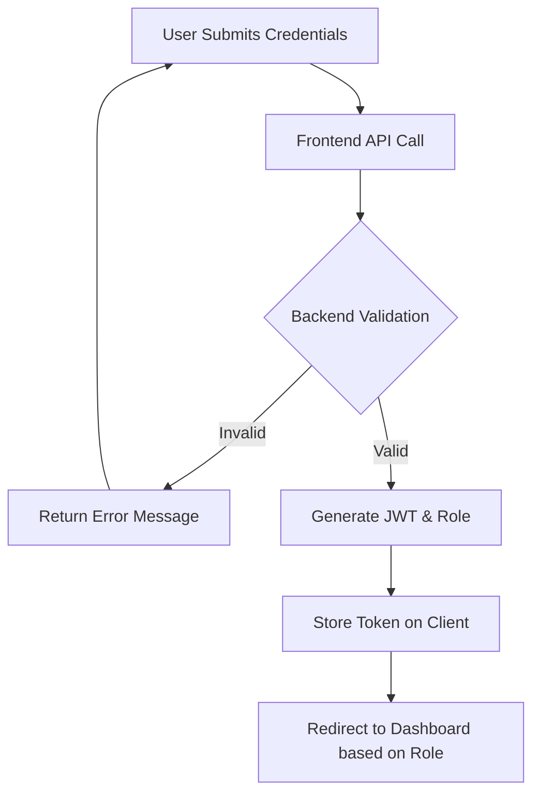
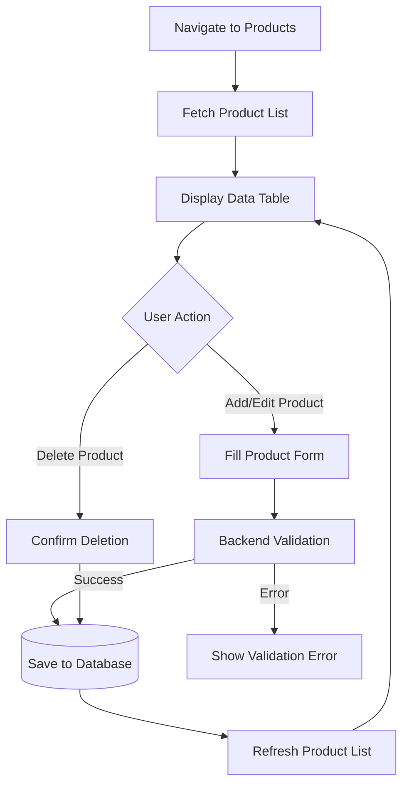
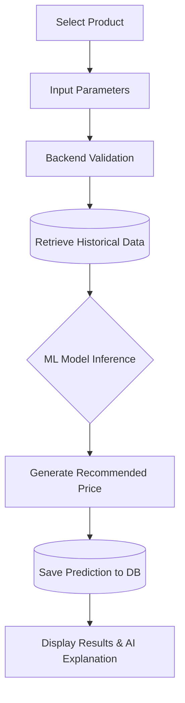
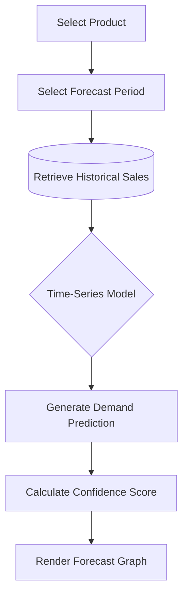
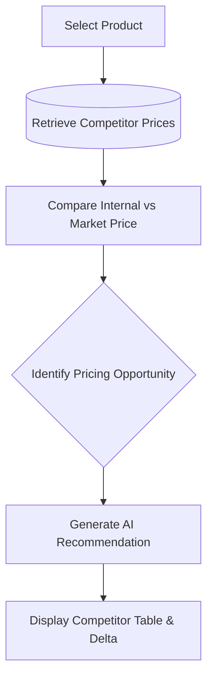
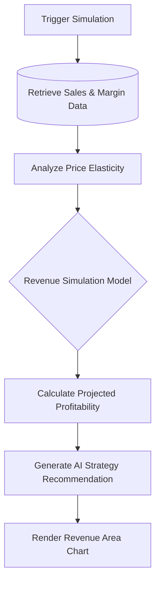
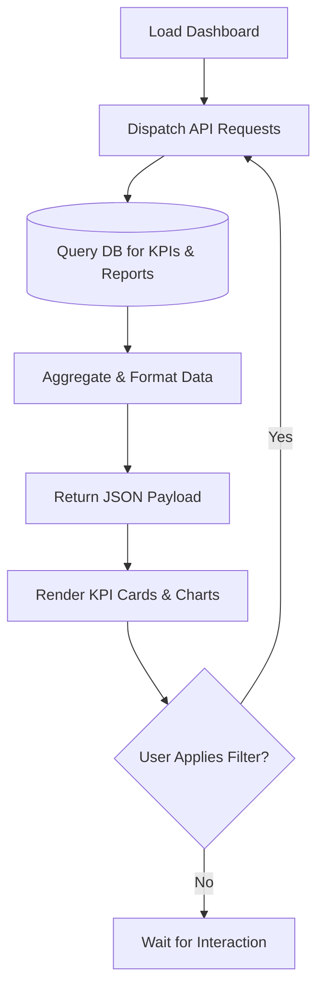
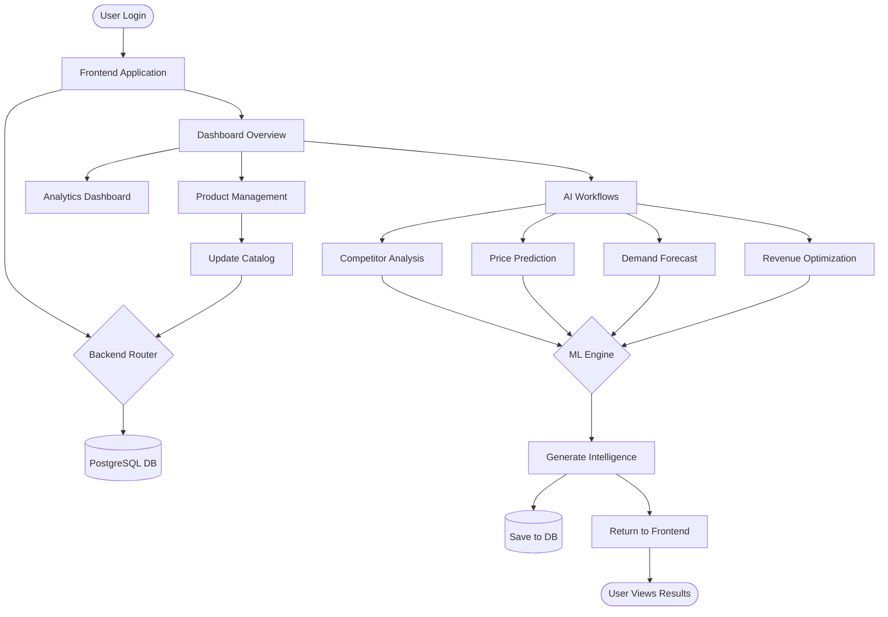

# Workflow Planning

## 1. Workflow Overview

Workflow planning is the process of mapping out the step-by-step sequence of operations required to complete specific business tasks within an application. It is a critical phase before development begins because it ensures that all edge cases, data handoffs, and user interactions are logically sound and agreed upon. 

In **PricePilot AI**, workflows act as the connective tissue between the 3-tier architecture. A workflow typically originates in the **Frontend** (React) via a user action, travels through the **Backend** (FastAPI) for validation and business logic, dips into the **Database** (PostgreSQL) for state management or historical context, routes complex analytical requests to the **AI Modules**, and finally returns a processed result back to the user's dashboard.

---

## 2. Authentication Workflow

**Step-by-Step Explanation:**
1. The user navigates to the login page and submits their email and password.
2. The React frontend sends these credentials to the FastAPI backend.
3. The backend validates the credentials against the hashed passwords in the PostgreSQL database.
4. Upon successful validation, the backend generates a secure JSON Web Token (JWT) containing the user's Role (Admin, Pricing Manager, or Business Analyst).
5. The frontend receives the JWT and stores it securely.
6. The frontend decodes the token for Role-Based Access Control (RBAC) and redirects the user to the appropriate Dashboard view.

---

## 3. Product Management Workflow

**Step-by-Step Explanation:**
1. The Pricing Manager or Admin navigates to the Product Management module.
2. The frontend requests the current product list from the backend, which retrieves it from the database and displays it in a data table.
3. To add or update a product, the user fills out a form (e.g., Name, SKU, Base Cost, Stock).
4. The frontend sends a POST/PUT request to the backend.
5. The backend validates the input data (checking for duplicate SKUs or invalid negative costs).
6. The data is saved to the PostgreSQL database.
7. The backend returns a success response, and the frontend refreshes the product list.

---

## 4. Price Prediction Workflow

**Step-by-Step Explanation:**
1. The Pricing Manager selects a specific product from the Prediction Module.
2. The manager inputs any necessary parameters (e.g., date range, current inventory levels).
3. The backend validates the request and retrieves historical sales data and base costs from the database.
4. The backend sends the structured data to the Machine Learning Model (XGBoost).
5. The ML Model processes the features and calculates the optimal recommended price and a confidence score.
6. The prediction is saved to the database for audit trails.
7. The result, including an AI explanation, is displayed to the user on the dashboard.

---

## 5. Demand Forecasting Workflow

**Step-by-Step Explanation:**
1. The Business Analyst selects a product group or specific SKU.
2. They select the forecast horizon (e.g., Next 30 Days).
3. The backend retrieves historical sales volume data from the database.
4. The data is fed into the Forecasting Model (Prophet/LSTM).
5. The model generates a time-series demand prediction with upper and lower confidence bounds.
6. The frontend renders the forecast as an interactive line chart on the dashboard.

---

## 6. Competitor Analysis Workflow

**Step-by-Step Explanation:**
1. The Pricing Manager accesses the Competitor Analysis module and selects a product.
2. The backend retrieves the latest competitor pricing data (either from an external API, a web scraper, or a database feed).
3. The system compares the internal base price against the market average.
4. The system identifies if the product is priced too high (losing volume) or too low (losing margin).
5. The AI generates a pricing recommendation to match, beat, or ignore the competitor.
6. The results are displayed in a comparison table.

---

## 7. Revenue Optimization Workflow

**Step-by-Step Explanation:**
1. The Business Analyst triggers a revenue simulation.
2. The system retrieves historical sales, current margins, and the demand curve.
3. The backend runs a profitability analysis across various simulated price points (e.g., -5% to +5%).
4. The ML engine calculates the projected revenue for each simulated price point based on price elasticity.
5. The system recommends the exact price point that yields the highest total revenue.
6. The frontend displays the revenue simulation chart.

---

## 8. Analytics Dashboard Workflow

**Step-by-Step Explanation:**
1. The user logs in and navigates to the Analytics Dashboard.
2. The React frontend asynchronously dispatches multiple API requests to the FastAPI backend.
3. The backend queries the database for Revenue KPIs, Product Performance, and recent Predictions.
4. The backend aggregates and formats this data into JSON.
5. The frontend receives the JSON payloads and maps them to Recharts components (Line charts, Bar charts, KPI cards).
6. The user can apply global date filters, which re-triggers the data fetching cycle.

---

## 9. User Workflow

### Admin
- **After Login:** Lands on the main dashboard.
- **Actions:** Can view all analytics, but primarily focuses on navigating to the **User Management** module to add new analysts, reset passwords, or assign roles. They can also view system health logs.

### Pricing Manager
- **After Login:** Lands on the dashboard, immediately checking the **Recent Predictions** alerts.
- **Actions:** Navigates to **Competitor Analysis** to see market threats. Moves to **Price Prediction** to run AI models on specific products. Reviews the AI explanations and officially applies new prices to the catalog.

### Business Analyst
- **After Login:** Lands on the dashboard to review total Revenue KPIs.
- **Actions:** Spends time in the **Demand Forecasting** and **Revenue Optimization** modules running long-term simulations. Exports data from the **Analytics Dashboard** to build reports for executive stakeholders.

---

## 10. End-to-End System Workflow

---

## 11. Business Process Summary

The workflows defined above orchestrate a seamless loop of intelligence. It begins with the **Product Management** and **Competitor Analysis** workflows establishing the baseline reality of the business. 

The core value is generated when the Pricing Manager utilizes the **Price Prediction** and **Demand Forecasting** workflows, invoking the AI models to find hidden efficiencies in the market. Finally, the **Revenue Optimization** and **Analytics Dashboard** workflows allow Business Analysts to step back, simulate macro-level strategies, and measure the overarching financial success of the platform. Together, these workflows transform raw e-commerce data into actionable, automated revenue growth.
