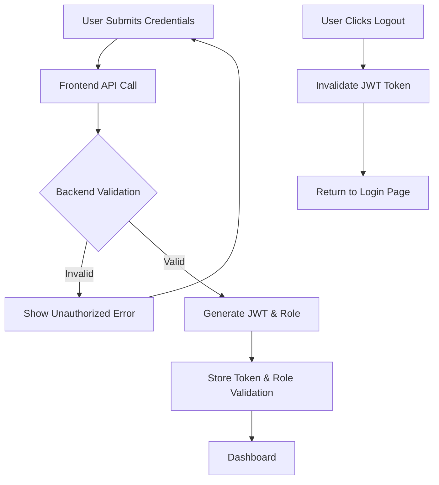
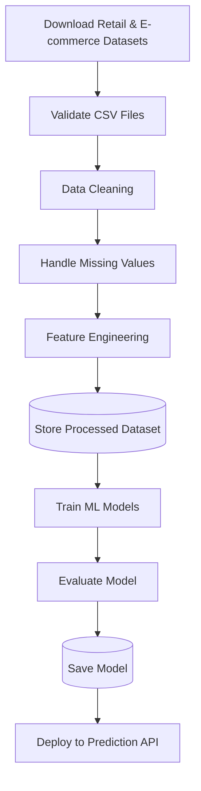
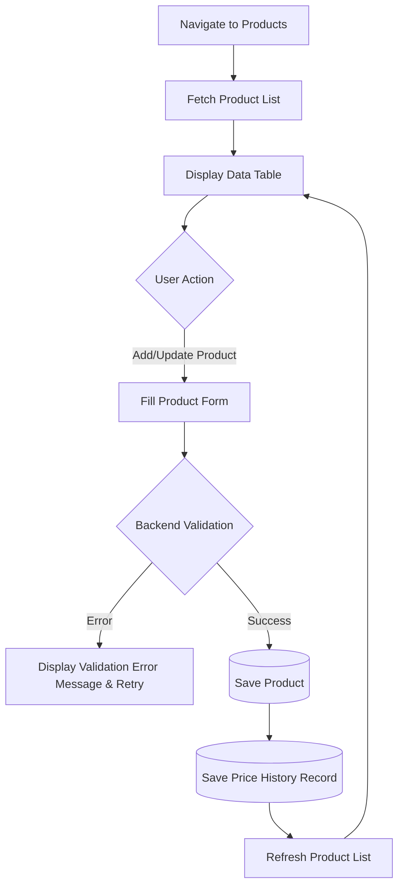
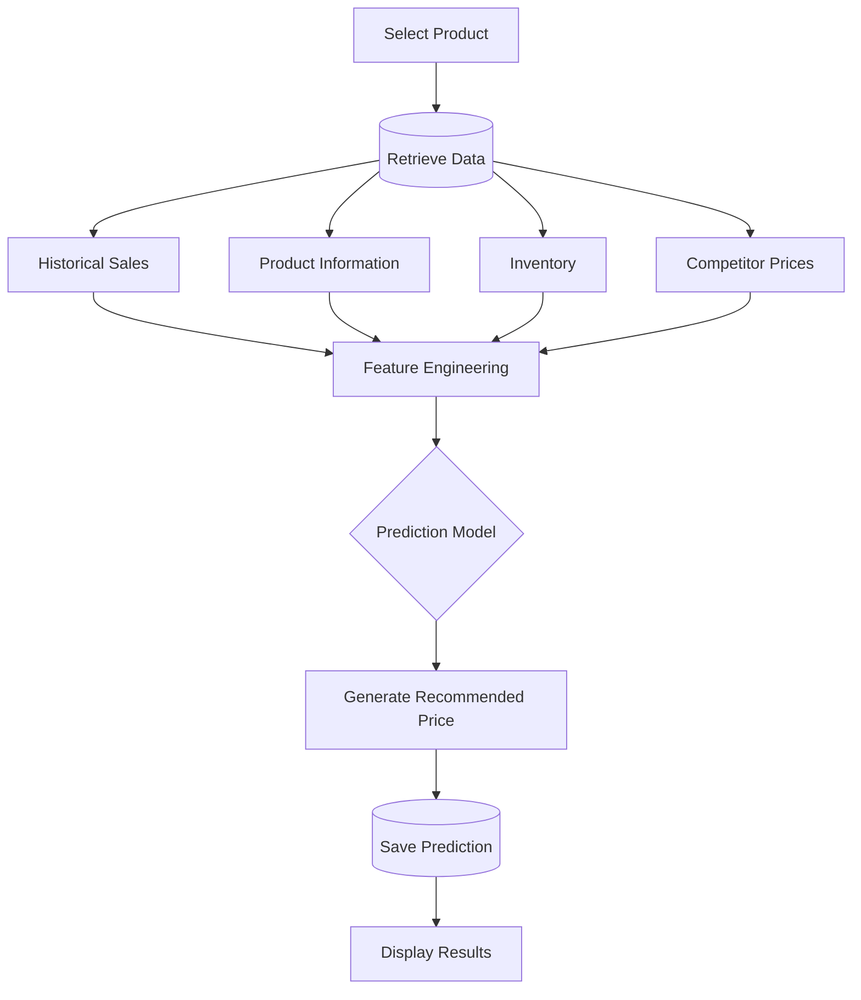
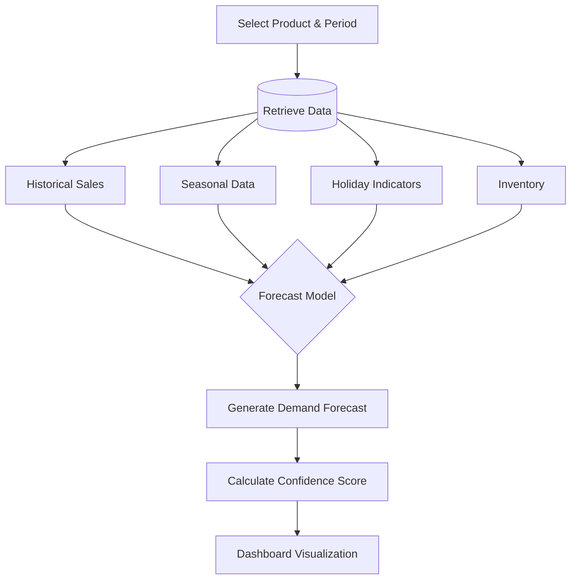
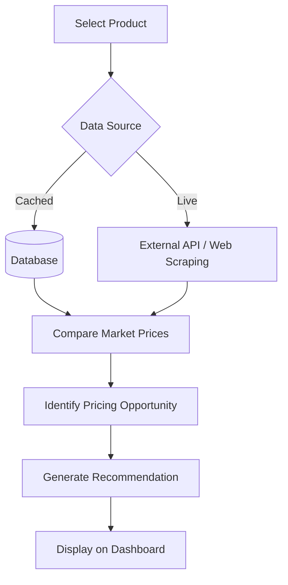
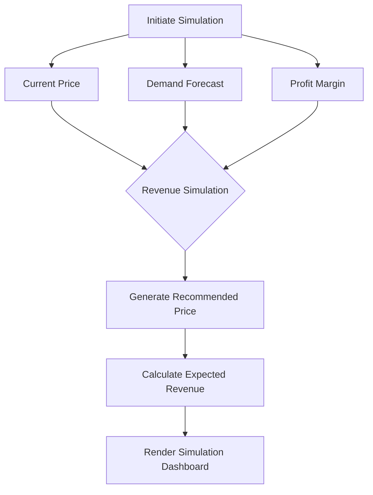
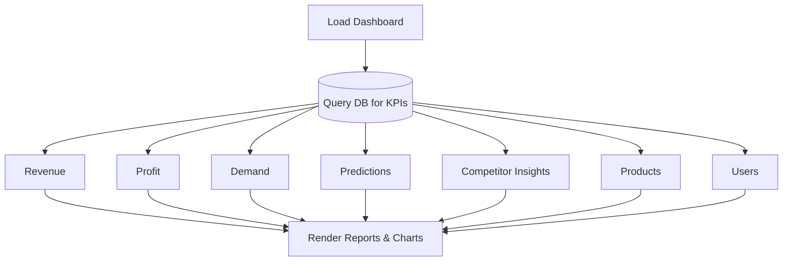
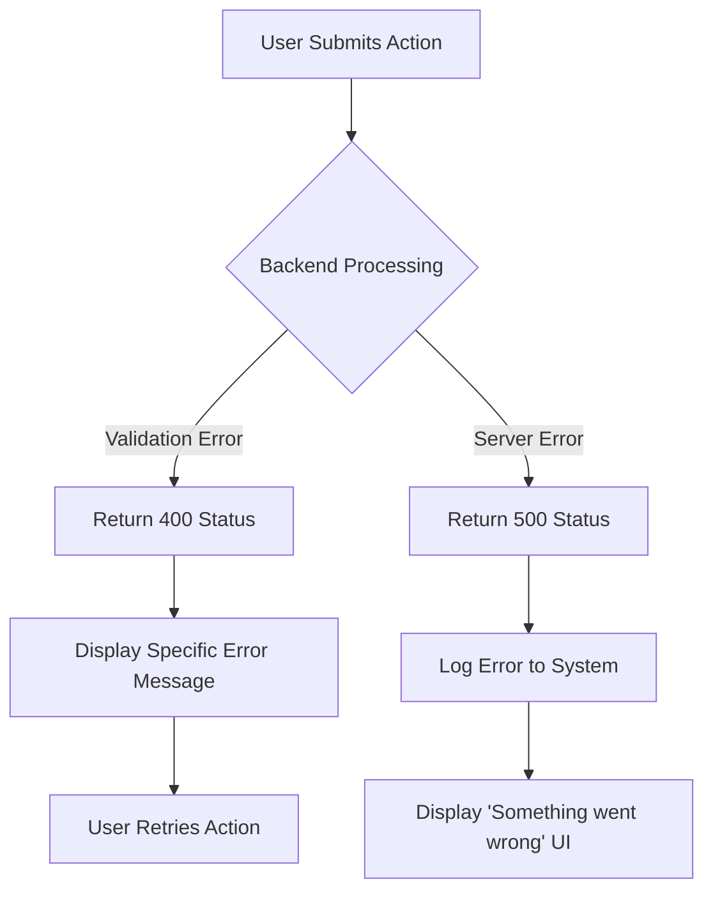
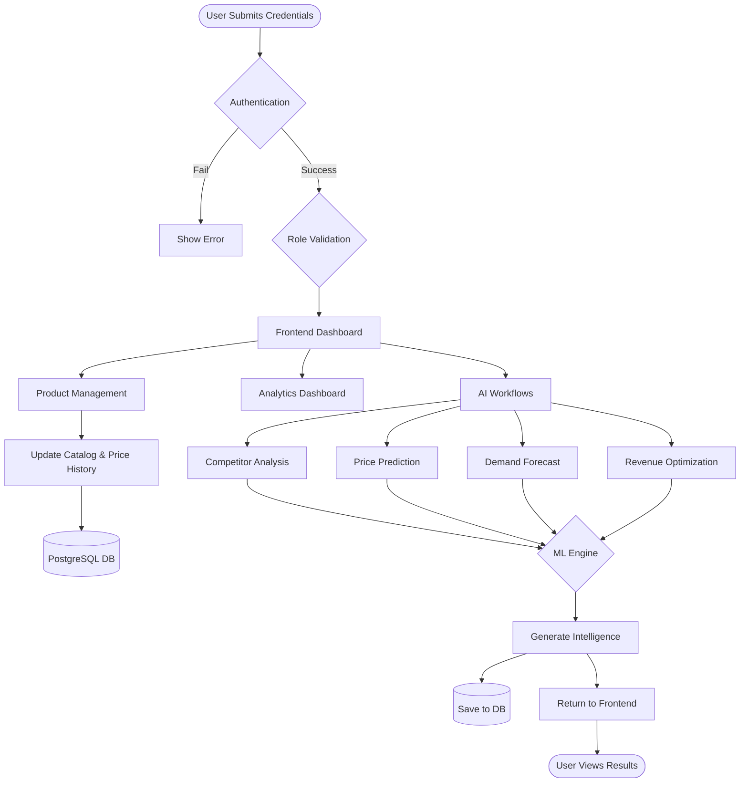

# Workflow Planning

## 1. Workflow Overview

Workflow planning is the process of mapping out the step-by-step sequence of operations required to complete specific business tasks within an application. It is a critical phase before development begins because it ensures that all edge cases, data handoffs, and user interactions are logically sound and agreed upon. 

In **PricePilot AI**, workflows act as the connective tissue between the 3-tier architecture. A workflow typically originates in the **Frontend** (React) via a user action, travels through the **Backend** (FastAPI) for validation and business logic, dips into the **Database** (PostgreSQL) for state management or historical context, routes complex analytical requests to the **AI Modules**, and finally returns a processed result back to the user's dashboard.

---

## 2. Authentication & Logout Workflow

**Step-by-Step Explanation (Login):**
1. The user navigates to the login page and submits credentials.
2. The React frontend sends these to the FastAPI backend.
3. The backend validates the credentials against the database.
4. Upon successful validation, the backend generates a JSON Web Token (JWT) containing the user's Role (Admin, Pricing Manager, or Business Analyst).
5. The frontend receives the JWT, decodes it for Role-Based Access Control (RBAC), and redirects the user to the Dashboard.

**Step-by-Step Explanation (Logout):**
1. The user clicks "Logout".
2. The frontend clears the JWT from local storage.
3. The backend invalidates the token (optional via blocklist).
4. The user is returned to the Login Page.

---

## 3. Dataset Loading & AI Model Training Workflow (Week 1-2 Core)

Because PricePilot AI relies heavily on machine learning (XGBoost, Prophet), offline dataset loading and model training are critical prerequisite workflows.

**Step-by-Step Explanation:**
1. **Download Dataset**: Raw Retail Pricing and E-commerce Sales CSVs are downloaded.
2. **Validate & Clean**: The backend validates the CSV structure, cleans the data, and handles any missing values (e.g., interpolating missing sales days).
3. **Feature Engineering**: New predictive features are created (moving averages, holiday flags).
4. **Train Model**: The processed dataset is fed into algorithms to train the model.
5. **Evaluate Model**: The model is scored (e.g., RMSE, MAE).
6. **Deploy**: The trained model is saved (e.g., as a `.pkl` file) and loaded into the Prediction API.

---

## 4. Product Management Workflow

**Step-by-Step Explanation:**
1. The Pricing Manager navigates to the Product Management module.
2. The frontend fetches and displays the product list.
3. The user adds or updates a product (e.g., new base cost).
4. The backend validates the input data.
5. The data is saved to the PostgreSQL database.
6. **Crucially, the system also saves a snapshot to the `Price History` table** to track dynamic pricing changes over time.
7. The product list refreshes.

---

## 5. Price Prediction Workflow

**Step-by-Step Explanation:**
1. The Pricing Manager selects a product to optimize.
2. The backend retrieves a highly contextual set of data: **Historical Sales**, **Product Information**, **Current Inventory**, and **Competitor Prices**.
3. The data undergoes real-time feature engineering.
4. The Prediction Model (XGBoost) calculates the optimal recommended price.
5. The prediction is saved to the database.
6. The result and confidence score are displayed to the user.

---

## 6. Demand Forecasting Workflow

**Step-by-Step Explanation:**
1. The Business Analyst selects a product and forecast period.
2. The backend retrieves **Historical Sales**, **Seasonal Data**, **Holiday Indicators**, and **Inventory**.
3. The data is fed into the Forecast Model (Prophet).
4. The model outputs a Demand Forecast with a Confidence Score.
5. The frontend renders this forecast as an interactive chart.

---

## 7. Competitor Analysis Workflow

**Step-by-Step Explanation:**
1. The Pricing Manager selects a product.
2. The system retrieves competitor prices via **External API integrations** or **Web Scraping bots**, supplementing it with cached **Database** records.
3. The system compares internal vs. market prices.
4. A pricing opportunity is identified.
5. An AI recommendation is generated and displayed on the dashboard.

---

## 8. Revenue Optimization Workflow

**Step-by-Step Explanation:**
1. The Analyst initiates a revenue optimization scenario.
2. The system combines the **Current Price**, the **Demand Forecast**, and the **Profit Margin**.
3. A simulation is run across various price points (elasticity testing).
4. The simulation outputs a Recommended Price that maximizes the Expected Revenue.
5. The results are displayed for review.

---

## 9. Analytics Dashboard Workflow

**Step-by-Step Explanation:**
1. The user navigates to the Analytics Dashboard.
2. The backend queries the database for strict KPIs.
3. The system aggregates and formats: **Revenue, Profit, Demand, Predictions, Competitor Insights, Products, and Users**.
4. The frontend renders these specific metrics into interactive charts and report tables.

---

## 10. General Error Handling Workflow

Enterprise systems must fail gracefully. Throughout all modules, error handling follows this standard flow to ensure the system never crashes ungracefully.

---

## 11. User Workflow

### Admin
- **After Login:** Passes role validation, lands on the main dashboard.
- **Actions:** Can view all analytics, but primarily focuses on navigating to the **User Management** module to add new analysts, reset passwords, or assign roles. They can also view system health logs.

### Pricing Manager
- **After Login:** Passes role validation, lands on the dashboard, checking **Recent Predictions** alerts.
- **Actions:** Navigates to **Competitor Analysis** to see market threats. Moves to **Price Prediction** to run AI models on specific products. Reviews the AI explanations and officially applies new prices to the catalog, generating new Price History records.

### Business Analyst
- **After Login:** Passes role validation, lands on the dashboard to review total Revenue KPIs.
- **Actions:** Spends time in the **Demand Forecasting** and **Revenue Optimization** modules running long-term simulations. Exports data from the **Analytics Dashboard** to build reports for executive stakeholders.

---

## 12. End-to-End System Workflow

---

## 13. Business Process Summary

The workflows defined above orchestrate a seamless loop of intelligence. It begins with the **Dataset Loading & Training** and **Product Management** workflows establishing the baseline reality of the business. 

The core value is generated when the Pricing Manager utilizes the **Price Prediction** and **Demand Forecasting** workflows, invoking the AI models (fed by rich inputs like inventory, seasonality, and competitor scraping) to find hidden efficiencies in the market. Finally, the **Revenue Optimization** and **Analytics Dashboard** workflows allow Business Analysts to step back, simulate macro-level strategies, and measure overarching KPIs like Revenue and Profit. Together, these workflows transform raw e-commerce data into actionable, automated revenue growth.
