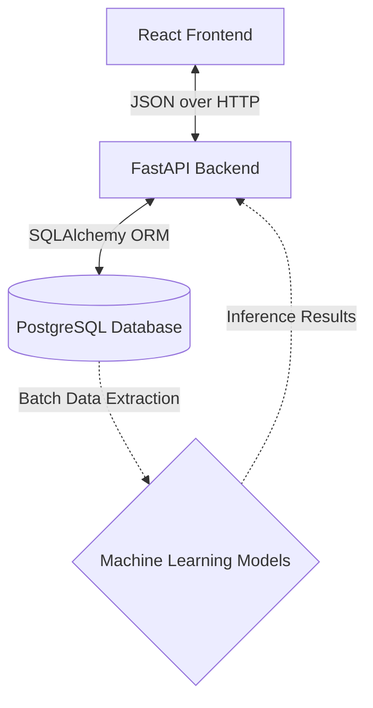
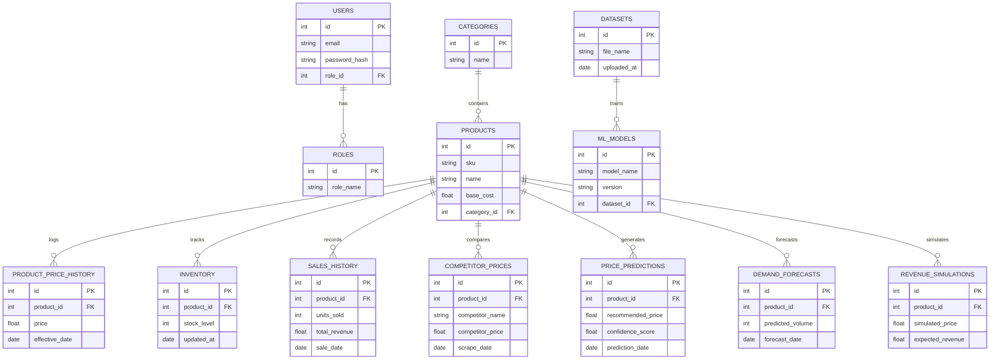
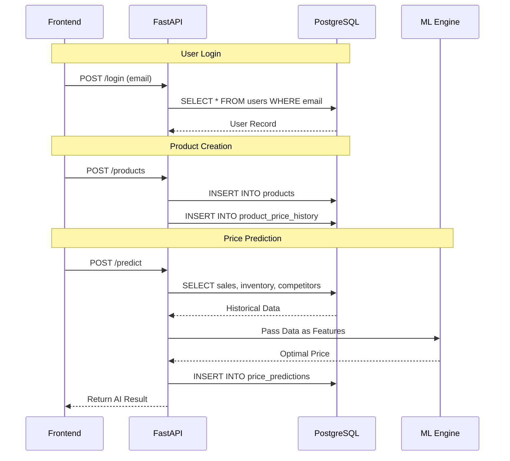

# Database Design Documentation

## 1. Database Design Overview

**PricePilot AI** relies on a highly structured, relational data model to support its core operations. 

- **Why PostgreSQL was selected**: PostgreSQL is an advanced, enterprise-grade, open-source relational database. It was chosen for its strict ACID compliance, robust support for complex analytical queries (essential for ML feature extraction), and its ability to handle both relational data and unstructured JSON (useful for storing complex ML model parameters).
- **Goals of the database**: To ensure absolute data integrity, provide fast read/write speeds for real-time dashboards, and maintain a strict historical ledger of pricing and sales data required for accurate machine learning forecasting.
- **How it supports the application**: The database acts as the single source of truth. It securely stores user identities, manages the core product catalog, tracks every historical price change, and serves as the data warehouse that feeds the AI Models.

---

## 2. Database Architecture

The database sits at the bottom of the 3-tier architecture, completely isolated from the frontend.

- **React Frontend**: Never interacts directly with the database. It only communicates via APIs.
- **FastAPI Backend**: Acts as the gatekeeper. It uses an Object-Relational Mapper (ORM) like SQLAlchemy to safely translate Python objects into SQL queries, ensuring SQL injection prevention.
- **Machine Learning Models**: The FastAPI backend extracts large batches of historical data from PostgreSQL, transforms it into DataFrames (Pandas), and feeds it to the ML engine (XGBoost/Prophet) for training and inference.

---

## 3. Entity Relationship Diagram (ERD)

---

## 4. Table Design

### 1. Roles
- **Purpose**: Defines access levels (Admin, Pricing Manager, Analyst).
- **Columns**: `id` (INT), `role_name` (VARCHAR).
- **PK**: `id`
- **Constraints**: `role_name` is UNIQUE and NOT NULL.

### 2. Users
- **Purpose**: Stores authenticated personnel.
- **Columns**: `id` (INT), `email` (VARCHAR), `password_hash` (VARCHAR), `role_id` (INT), `created_at` (TIMESTAMP).
- **PK**: `id` | **FK**: `role_id` -> Roles(id)
- **Constraints**: `email` is UNIQUE and NOT NULL.
- **Defaults**: `created_at` = CURRENT_TIMESTAMP.

### 3. Categories
- **Purpose**: Groups products logically.
- **Columns**: `id` (INT), `name` (VARCHAR).
- **PK**: `id`
- **Constraints**: `name` is UNIQUE.

### 4. Products
- **Purpose**: The core catalog item.
- **Columns**: `id` (INT), `sku` (VARCHAR), `name` (VARCHAR), `base_cost` (NUMERIC), `category_id` (INT), `is_active` (BOOLEAN).
- **PK**: `id` | **FK**: `category_id` -> Categories(id)
- **Constraints**: `sku` is UNIQUE and NOT NULL. `base_cost` > 0.
- **Defaults**: `is_active` = TRUE.

### 5. Product_Price_History
- **Purpose**: Ledger of all historical price changes.
- **Columns**: `id` (INT), `product_id` (INT), `price` (NUMERIC), `effective_date` (TIMESTAMP).
- **PK**: `id` | **FK**: `product_id` -> Products(id)
- **Constraints**: `price` > 0.

### 6. Inventory
- **Purpose**: Real-time stock levels.
- **Columns**: `id` (INT), `product_id` (INT), `stock_level` (INT), `updated_at` (TIMESTAMP).
- **PK**: `id` | **FK**: `product_id` -> Products(id)
- **Constraints**: `stock_level` >= 0.

### 7. Sales_History
- **Purpose**: Daily aggregate of units sold.
- **Columns**: `id` (INT), `product_id` (INT), `units_sold` (INT), `total_revenue` (NUMERIC), `sale_date` (DATE).
- **PK**: `id` | **FK**: `product_id` -> Products(id)

### 8. Competitor_Prices
- **Purpose**: Scraped external market data.
- **Columns**: `id` (INT), `product_id` (INT), `competitor_name` (VARCHAR), `competitor_price` (NUMERIC), `scrape_date` (TIMESTAMP).
- **PK**: `id` | **FK**: `product_id` -> Products(id)

### 9. Price_Predictions
- **Purpose**: Log of AI price recommendations.
- **Columns**: `id` (INT), `product_id` (INT), `recommended_price` (NUMERIC), `confidence_score` (NUMERIC), `prediction_date` (TIMESTAMP).
- **PK**: `id` | **FK**: `product_id` -> Products(id)

### 10. Demand_Forecasts
- **Purpose**: Log of future sales projections.
- **Columns**: `id` (INT), `product_id` (INT), `predicted_volume` (INT), `forecast_date` (DATE).
- **PK**: `id` | **FK**: `product_id` -> Products(id)

### 11. Revenue_Simulations
- **Purpose**: Saved scenarios for profitability analysis.
- **Columns**: `id` (INT), `product_id` (INT), `simulated_price` (NUMERIC), `expected_revenue` (NUMERIC), `created_at` (TIMESTAMP).
- **PK**: `id` | **FK**: `product_id` -> Products(id)

### 12. Datasets
- **Purpose**: Tracks uploaded CSV files for ML training.
- **Columns**: `id` (INT), `file_name` (VARCHAR), `uploaded_at` (TIMESTAMP).
- **PK**: `id`

### 13. ML_Models
- **Purpose**: Registry of trained algorithms.
- **Columns**: `id` (INT), `model_name` (VARCHAR), `version` (VARCHAR), `dataset_id` (INT).
- **PK**: `id` | **FK**: `dataset_id` -> Datasets(id)

---

## 5. Relationship Explanation

- **One-to-One**: (Rare in this schema). A theoretical example would be if `Inventory` was strictly one row per product, but we use a history log to track changes.
- **One-to-Many (1:N)**: This is the dominant relationship.
  - *One Category has Many Products*.
  - *One Product has Many Sales History records*. (Allows tracking sales over time).
  - *One Product has Many Price Predictions*. (Allows tracking AI performance over time).
- **Many-to-One (N:1)**: The inverse of 1:N.
  - *Many Users belong to One Role*. (Multiple people can be "Pricing Managers").
- **Many-to-Many (M:N)**: Currently handled via association tables if required, but the core business logic isolates entities to a Hub-and-Spoke model centered around the `Products` table.

---

## 6. Database Constraints

Strict constraints guarantee data integrity before data ever reaches the application logic:
- **Primary Keys (PK)**: Every table has a unique, auto-incrementing `id` to ensure absolute row uniqueness.
- **Foreign Keys (FK)**: Ensures referential integrity. (e.g., You cannot insert a sale for a `product_id` that does not exist in the `Products` table).
- **Unique Constraints**: Applied to `Users.email` and `Products.sku` to prevent duplicates.
- **NOT NULL**: Applied to critical fields like passwords, costs, and SKUs.
- **CHECK Constraints**: `base_cost > 0`, `stock_level >= 0`, ensuring mathematically impossible data cannot be inserted.
- **Default Values**: `created_at` defaults to the exact timestamp the row is inserted. `is_active` defaults to `TRUE`.

---

## 7. Indexing Strategy

To ensure queries return in milliseconds even with millions of rows, B-Tree indexes are applied to frequently searched columns:
- **`email`**: Indexed for ultra-fast User Login lookups.
- **`sku`**: Indexed because Product Searches in the dashboard heavily rely on it.
- **`product_id` (Foreign Keys)**: All Foreign Keys are indexed. When fetching the "Price History" for a specific product, indexing `product_id` prevents full-table scans.
- **`forecast_date` & `prediction_date`**: Indexed for fast time-series queries (e.g., "Get all forecasts for the next 30 days").
- **`created_at`**: Indexed for chronological sorting in Analytics Dashboards.

---

## 8. Database Normalization

The schema adheres strictly to the Third Normal Form (3NF) to eliminate data redundancy.
- **First Normal Form (1NF)**: All columns contain atomic values. There are no arrays or comma-separated lists stored in columns.
- **Second Normal Form (2NF)**: All non-key attributes are fully functionally dependent on the Primary Key.
- **Third Normal Form (3NF)**: There are no transitive dependencies. For example, instead of storing `role_name` directly in the `Users` table (which would duplicate the string "Pricing Manager" 100 times), we store it in a `Roles` table and link via `role_id`.

---

## 9. Data Flow

---

## 10. Database Security

- **Password Hashing**: Plain text passwords are never stored. Passwords are hashed using bcrypt before insertion.
- **Role-Based Access**: Handled application-side, but the DB natively supports row-level security (RLS) if multi-tenancy is introduced later.
- **SQL Injection Prevention**: Using SQLAlchemy ORM ensures all inputs are parameterized and sanitized automatically.
- **Transactions**: Complex operations (like adding a Product AND updating Inventory simultaneously) use ACID transactions. If one fails, the entire operation rolls back.
- **Backups**: PostgreSQL supports point-in-time recovery (PITR) and automated daily cron backups.
- **Audit Logs**: Timestamps (`created_at`, `updated_at`) act as a basic audit trail. Soft-deletes (`is_active = FALSE`) prevent accidental permanent data loss.

---

## 11. Future Improvements

As the dataset grows (specifically tables like `Sales_History` and `Competitor_Prices`), the following enterprise enhancements should be considered:
- **Table Partitioning**: Splitting the `Sales_History` table by year or month to speed up time-series queries.
- **Read Replicas**: Routing all Analytics Dashboard `GET` requests to a read-only replica database to prevent slowing down the primary master database.
- **Materialized Views**: Pre-computing complex joins (e.g., Total Revenue per Category) overnight and storing them in materialized views for instant dashboard loading.
- **Database Caching**: Putting a Redis layer in front of PostgreSQL to cache product catalogs and static data.
- **Time-Series Optimization**: Eventually migrating the purely historical data (like daily competitor prices) to a specialized time-series database (like TimescaleDB, a PostgreSQL extension).
