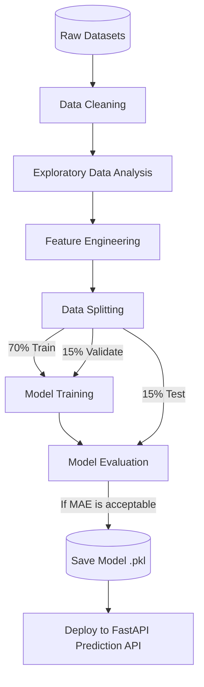

# Dataset Analysis & Machine Learning Strategy

## 1. Dataset Overview

- **Why datasets are required**: Machine Learning models are not programmed with explicit business rules; they learn patterns from historical data. High-quality datasets are the foundation of any AI model, providing the context required to make accurate future predictions.
- **Business Objective**: To maximize total revenue and protect profit margins by understanding how price changes impact customer purchasing behavior in a competitive e-commerce landscape.
- **AI Objective**: To train predictive models capable of accurately forecasting future demand and dynamically recommending optimal product prices based on complex, multi-variable environments.

---

## 2. Dataset Sources

PricePilot AI utilizes two primary open-source/synthetic datasets commonly found in enterprise retail environments:

### 1. Retail Pricing Dataset
- **Source**: Kaggle / Enterprise Data Warehouse Extracts
- **Format**: `.csv` (Comma Separated Values)
- **Size**: ~500,000+ records
- **Description**: Contains historical snapshots of product base costs, competitor pricing scrapes, and the applied discount strategies over time.

### 2. E-commerce Sales Dataset
- **Source**: Kaggle / Internal ERP (Enterprise Resource Planning) Systems
- **Format**: `.csv`
- **Size**: ~1,000,000+ records
- **Description**: A transactional ledger detailing daily units sold, total revenue generated, inventory levels, and timestamped purchase events.

---

## 3. Dataset Structure

To train effective models, the datasets are merged on `Product ID` and `Date`. The resulting structure contains the following critical features:

- **Product ID**: Unique identifier for the item.
- **Category**: The logical grouping of the product (e.g., Electronics, Apparel).
- **Historical Price**: The exact price the product was sold at on a specific date.
- **Units Sold**: The total quantity purchased on that date.
- **Revenue**: Total income generated (`Historical Price` × `Units Sold`).
- **Discount**: The monetary amount or percentage discounted from the base price.
- **Promotion**: A binary indicator (Yes/No) if the product was part of a marketing campaign.
- **Stock**: The inventory level at the start of the day.
- **Competitor Price**: The scraped price of the same item from a primary competitor.
- **Holiday Indicator**: Identifies if the date falls on a major retail holiday (e.g., Black Friday).
- **Day of Week**: The day the sale occurred (Monday-Sunday).
- **Month**: The month of the sale, crucial for macro-trends.
- **Season**: Categorical value (Spring, Summer, Fall, Winter).
- **Demand (Target Variable 1)**: The future units expected to be sold.
- **Optimal Price (Target Variable 2)**: The theoretical price that yields the highest revenue.

---

## 4. Data Types

| Feature | Data Type | Description |
|---------|-----------|-------------|
| `product_id` | Integer | Unique identifier for the product |
| `category` | String (Categorical) | Product classification grouping |
| `historical_price`| Float | The selling price of the item |
| `units_sold` | Integer | Quantity of items purchased |
| `revenue` | Float | Calculated income for the day |
| `discount` | Float | Discount amount applied |
| `promotion` | Boolean | True if active promotion, False otherwise |
| `stock` | Integer | Units remaining in inventory |
| `competitor_price`| Float | Competitor's selling price |
| `holiday_indicator`| Boolean | True if the date is a holiday |
| `day_of_week` | Integer | 0 (Monday) to 6 (Sunday) |
| `month` | Integer | 1 (January) to 12 (December) |
| `season` | String (Categorical) | Spring, Summer, Fall, Winter |
| `date` | Datetime | Exact date of the transaction |

---

## 5. Data Quality Assessment

Before training, the raw data must be evaluated for quality issues:
- **Missing Values**: Empty cells where data failed to record (e.g., a web scraper failed to get a `competitor_price` for 3 days).
- **Duplicate Records**: The same transaction accidentally logged twice in the ERP system.
- **Outliers**: Extreme anomalies (e.g., a glitch showing a $1,000 laptop sold for $1).
- **Invalid Data**: Data that breaks business logic (e.g., negative `units_sold` or negative `stock`).
- **Inconsistent Records**: Formatting issues, such as categories written as "Electronics", "electronics", and "ELEC".

---

## 6. Data Cleaning

To resolve the quality issues, the following cleaning pipeline is applied:
- **Removing Duplicates**: Dropping exact duplicate rows based on `product_id` and `date`.
- **Handling Missing Values**: Using Forward-Fill (ffill) for missing competitor prices, or interpolating missing sales days with moving averages.
- **Outlier Detection**: Using the Interquartile Range (IQR) method or Z-scores to identify and cap extreme price or sales spikes.
- **Data Validation**: Dropping rows where `stock` < 0 or `historical_price` <= 0.
- **Data Formatting**: Standardizing all strings to lowercase and converting `date` strings into proper Pandas Datetime objects.

---

## 7. Exploratory Data Analysis (EDA)

EDA is the process of visually understanding the data before modeling. 

- **Price Distribution**: Histograms showing the spread of product prices across categories.
- **Sales Trends**: Line charts plotting total units sold over time to identify macro growth.
- **Seasonality**: Bar charts showing average sales by month to spot peaks (e.g., Holiday season spikes).
- **Demand Patterns**: Scatter plots mapping `Historical Price` against `Units Sold` to visualize price elasticity (demand curves).
- **Competitor Price Analysis**: Dual-axis line charts comparing our price vs. competitor price over time.
- **Inventory Analysis**: Area charts showing stock depletion rates leading up to stockouts.
- **Revenue Analysis**: Heatmaps showing which product categories generate the most revenue on specific days of the week.

---

## 8. Feature Engineering

Machine learning models require complex, derived data to find deep patterns. We engineer the following features:

- **Price Difference**: `competitor_price` - `historical_price`. (Tells the model exactly how much cheaper/more expensive we are).
- **Discount Percentage**: `discount` / `base_cost`. (Standardizes discounts across cheap and expensive items).
- **Moving Average Sales (7-day / 30-day)**: Smooths out daily sales spikes to show true momentum.
- **Rolling Revenue**: Tracks cumulative revenue trends.
- **Inventory Turnover**: Calculates how fast stock is depleting.
- **Holiday Flag**: 1 if a holiday, 0 otherwise (Massively improves Prophet forecasts).
- **Weekend Flag**: 1 if Saturday/Sunday, 0 otherwise.
- **Season Encoding**: One-Hot Encoding (converting "Summer" into numerical columns).
- **Lag Features**: E.g., `sales_yesterday`, `sales_last_week`. (Essential for time-series forecasting, as past sales strongly predict future sales).

---

## 9. Feature Selection

Not all features are used for every model. Selecting the right features prevents "noise".

- **For Price Prediction**: `historical_price`, `competitor_price`, `stock`, `moving_average_sales`, `price_difference`, `season`.
- **For Demand Forecasting**: `date`, `units_sold`, `holiday_flag`, `weekend_flag`, `promotion`, `lag_features`.
- **For Revenue Optimization**: `historical_price`, `demand_forecast`, `discount_percentage`, `base_cost`.
- **For Competitor Analysis**: `competitor_price`, `historical_price`, `category`.

---

## 10. Dataset Split

To ensure the AI models can generalize to new data, the dataset is strictly split chronologically (because this is time-series data, random splitting causes data leakage).

- **Training Set (70%)**: The oldest data. Used to teach the model patterns.
- **Validation Set (15%)**: Used during training to tune hyperparameters and prevent overfitting.
- **Testing Set (15%)**: The most recent data. Used strictly at the end to evaluate the final accuracy of the model on unseen data.

---

## 11. Machine Learning Models

### XGBoost (Extreme Gradient Boosting)
- **Why**: The industry standard for tabular data. It handles non-linear relationships exceptionally well and is highly resistant to outliers.
- **Used For**: **Price Prediction**. It easily calculates complex interactions between inventory, competitor prices, and seasonality to output an optimal price.

### Prophet
- **Why**: Developed by Meta (Facebook), it is designed specifically for time-series forecasting with strong seasonal effects and missing data.
- **Used For**: **Demand Forecasting**. It excels at predicting future sales volumes based on historical dates and holiday flags.

### Random Forest
- **Why**: An ensemble method that builds multiple decision trees. Great for interpretability.
- **Used For**: **Feature Importance**. Used during EDA to understand which features (e.g., price vs. promotion) impact revenue the most.

### LSTM (Long Short-Term Memory)
- **Why**: A Deep Learning Recurrent Neural Network (RNN) that remembers long-term dependencies.
- **Used For**: Advanced **Demand Forecasting** for highly volatile products where Prophet may struggle. (Secondary/Future implementation).

---

## 12. Model Evaluation

Models are evaluated using standard regression metrics:
- **MAE (Mean Absolute Error)**: The average absolute difference between predicted and actual values. (Easy to explain to business stakeholders).
- **RMSE (Root Mean Squared Error)**: Heavily penalizes large errors. Crucial for ensuring the model doesn't make massive pricing mistakes.
- **R² Score (Coefficient of Determination)**: Measures how much of the variance in the target variable is explained by the model (e.g., 0.85 means the model is very accurate).
- **MAPE (Mean Absolute Percentage Error)**: Expresses error as a percentage (e.g., "Forecast is off by 5%").
- **Forecast Accuracy**: `100% - MAPE`.
- **Confidence Score**: A custom metric outputted alongside predictions to tell the UI how "sure" the model is, based on historical data density.

---

## 13. Data Pipeline

---

## 14. Challenges

- **Data Quality**: E-commerce data is notoriously messy. Missing days of sales (due to stockouts) confuse forecasting models.
- **Data Imbalance**: Some popular products have years of data, while new products have almost none.
- **Seasonality**: Black Friday or COVID-19 anomalies can permanently skew historical models if not handled properly.
- **Cold Start**: AI cannot predict optimal prices for brand-new products with zero historical data.
- **Missing Competitor Data**: Web scrapers often break, leading to large gaps in `competitor_price` data.
- **Model Drift**: Consumer behavior changes over time. A model trained in 2024 will lose accuracy in 2026 without retraining.

---

## 15. Future Improvements

To elevate this to a cutting-edge Enterprise MLOps architecture:
- **Real-time Streaming Data**: Moving from batch CSV uploads to real-time Kafka streams for instant inventory and price updates.
- **Auto Retraining**: Scheduling Apache Airflow pipelines to automatically retrain XGBoost models every month.
- **Feature Store**: Implementing a Feature Store (like Feast) to serve engineered features instantly to the FastAPI backend.
- **Data Versioning**: Using tools like DVC (Data Version Control) to track exactly which dataset trained which model version.
- **MLOps Pipeline**: Using MLflow to track experiments, hyperparameter tuning, and model registries across the entire data science team.
